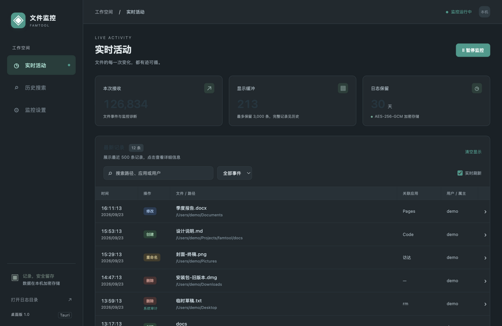
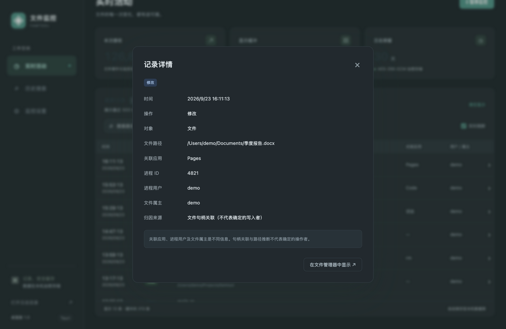
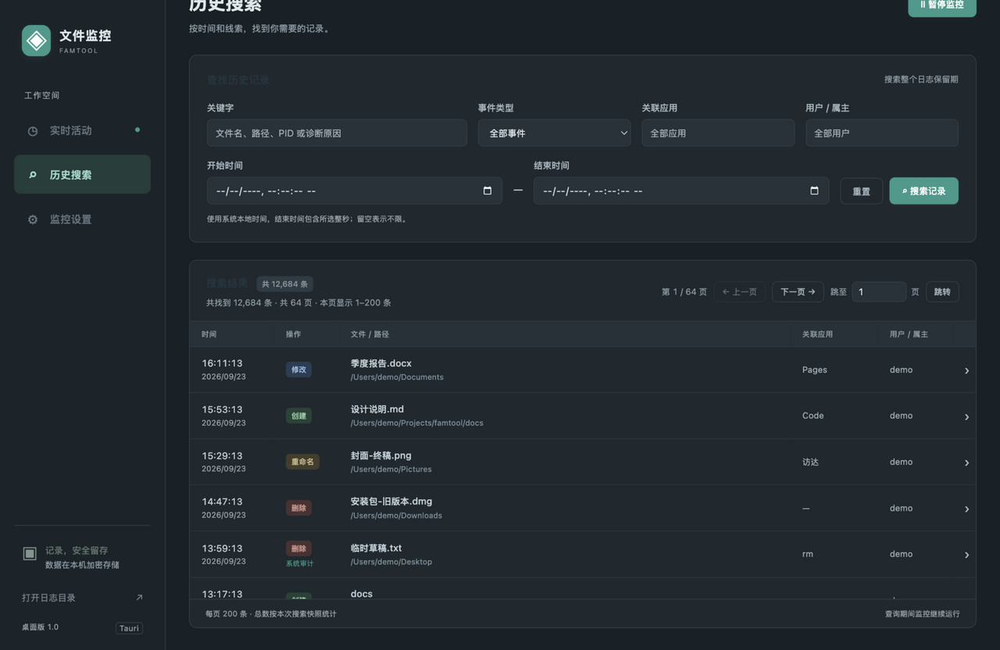
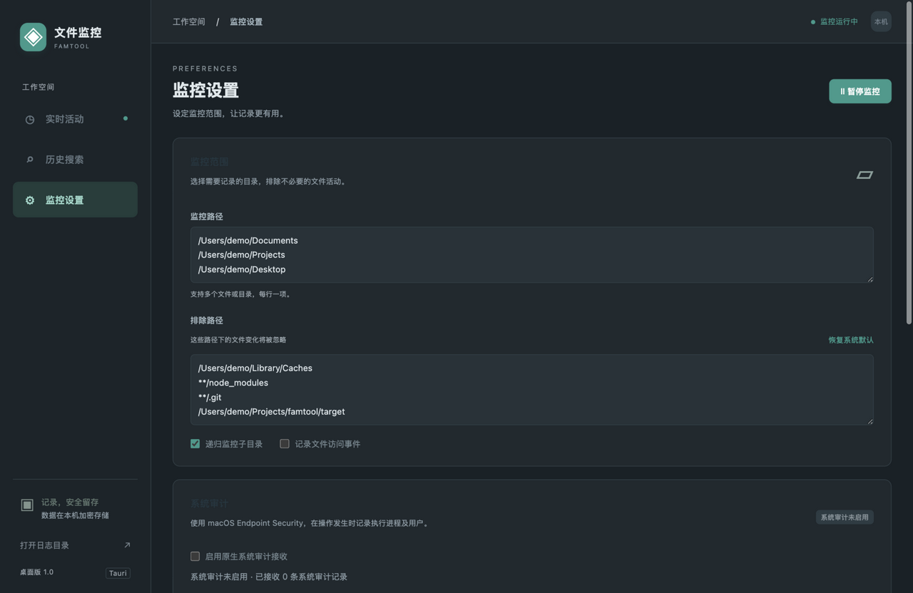

# FAMTool（文件监控）— 跨平台文件/文件夹操作监控记录工具

用 Rust 编写，可运行于 **Windows / Linux / macOS**。基于操作系统原生文件系统通知机制实时监控（默认**整个磁盘**），把文件和文件夹的**创建、修改（编辑）、重命名、删除**等操作持久化到加密 SQLite 日志库，提供 **CLI** 和 **GUI（托盘驻留）** 两种使用方式。

| 平台 | 底层机制 |
|---|---|
| Windows | ReadDirectoryChangesW（可选原生系统审计：SACL + 安全日志） |
| Linux | inotify（可选原生系统审计：内核 fanotify） |
| macOS | FSEvents（可选原生系统审计：Endpoint Security / OpenBSM） |

## 项目结构

```
crates/core   核心库 famtool-core：事件采集、时间窗口聚合、监控引擎、加密日志与配置持久化
crates/cli    命令行版本（二进制名 famtool）
crates/gui    Tauri 2 桌面版本（产品名 FAMTool，托盘驻留，界面中文名"文件监控"）
scripts/      package.sh 全平台打包脚本；native 审计辅助程序构建
native/audit  macOS 原生审计辅助程序（Objective-C）
```

命名约定：英文产品名 **FAMTool**，界面与文档中文名 **文件监控**；应用标识 `com.famtool.app`，macOS 审计守护进程 `com.famtool.audit`。

## 快速开始

### 从安装包安装

`dist/` 内为各平台安装程序（均为 ad-hoc 签名，首次运行系统会提示未知发布者）：

| 平台 | 文件 |
|---|---|
| macOS 11+ Apple Silicon | `FAMTool_*_macos_aarch64.dmg` |
| macOS 11+ Intel | `FAMTool_*_macos_x86_64.dmg` |
| Windows 10+ x64 | `FAMTool_*_x64-setup.exe`（NSIS，当前用户模式，缺 WebView2 时自动下载） |
| Linux x86_64 / arm64 | `FAMTool_*.deb`、`FAMTool-*.rpm` |

### 从源码运行（开发）

```bash
npm ci
npm run dev                    # Tauri 开发模式，前端资源来自 crates/gui/ui
cargo build --release          # Rust CLI 与桌面二进制
npm test                       # 前端测试
cargo test --workspace         # Rust 测试
cargo clippy --workspace --all-targets -- -D warnings
```

需要 Node.js、Rust 与 Tauri 对应平台的系统依赖：macOS 用系统 WebKit；Windows 用 WebView2；Linux 需要 WebKitGTK 4.1/GTK 及托盘相关开发库。`package-lock.json` 与 `Cargo.lock` 固定依赖版本。

## 打包（单脚本）

全部打包流程集中在 **`scripts/package.sh`** 一个脚本内。脚本在打包前自动跑前端测试自检（`WJ_SKIP_CHECKS=1` 可跳过），为每个目标三元组构建 audit-pipe sidecar（`tauri.conf.json` 的 `externalBin` 要求其存在于 `crates/gui/binaries/`），构建后校验产物落盘并生成 `dist/SHA256SUMS` 校验清单；出错时会打印脚本行号定位。

```bash
./scripts/package.sh                          # 全部平台(缺依赖的平台自动跳过并提示)
./scripts/package.sh macos                    # macOS 双架构 DMG
./scripts/package.sh macos --target x86_64-apple-darwin
./scripts/package.sh windows                  # Windows NSIS 安装程序
./scripts/package.sh linux                    # Linux deb+rpm(本机 Docker 架构)
./scripts/package.sh linux --platform amd64   # x86_64(需 Docker Rosetta/QEMU)
./scripts/package.sh clean                    # 清理 dist/ 与打包中间产物
./scripts/package.sh --help
```

各平台依赖：

- **macOS**：脚本执行 Tauri 打包、签名并用 `hdiutil` 生成 DMG（自动做 `hdiutil verify` 完整性校验）。设置 `WJ_APP_SIGN_IDENTITY` 切换为正式开发者签名。审计辅助程序按目标架构单独编译，故不提供 universal 包。
- **Windows**：从 macOS/Linux 交叉构建需要 `cargo install cargo-xwin`、`brew install llvm nsis`（脚本自动把 LLVM 加入 PATH）；在 Windows 宿主上则使用本机 MSVC 工具链，只需安装 NSIS（MSI/WiX 只能在 Windows 宿主生成；GitHub Actions 的 Windows 任务可直接产出 NSIS+MSI）。
- **Linux**：Ubuntu 22.04 容器内编译（`scripts/docker/Dockerfile.linux`），依赖清单见 `tauri.conf.json` 的 `bundle.linux`。Docker 未运行时脚本会在 macOS 上自动拉起 Docker Desktop 并等待就绪。容器内默认 2 路并行编译防 VM 内存不足（`WJ_CARGO_JOBS=n` 调整）；增量产物损坏时 `WJ_CLEAN=1` 重跑。
- **CI**：`.github/workflows/build.yml` 在 GitHub 官方运行器上构建全部平台（Windows 附加 MSI），推送 `v*` 标签或手动触发；各任务在 `npm run build` 前先构建对应三元组的 audit-pipe sidecar。


## GUI 使用

> 以下界面截图使用演示数据（`/Users/demo/…` 均为虚构路径）。

### 实时活动

监控状态、本次接收数量、显示缓冲和保留期限；表格展示最新 500 条，支持路径/应用/用户/事件过滤和暂停实时刷新。



### 记录详情

点击表格行查看完整路径、原路径、PID、关联来源、用户、属主及诊断说明，可在文件管理器定位现存文件。



### 历史搜索

搜索整个保留期，支持日期和时分秒、关键字、事件、应用及用户，后台查询、可取消、显示匹配总数与总页数，支持页码跳转。



### 监控设置

多路径监控、排除目录、递归/访问事件、保留期限和聚合窗口；保存时应用设置，保留此前的运行/暂停状态。



### 托盘与其他

- **删除日志**：设置页和托盘菜单均有入口，明确确认后删除全部当前数据库记录，保留配置、密钥，恢复此前监控状态。
- **托盘驻留**：关窗隐藏并继续监控，左键托盘或 Dock 点击恢复；右键可显示窗口、开始/暂停、进入历史、删除日志或退出。退出会排空队列。
- 界面由系统 WebView 原生渲染，遵循系统明暗主题与显示缩放；前端没有通用 Shell、文件系统插件或远程页面访问，路径等数据库内容按文本转义显示。
- 开机自启可在系统登录项中添加 `FAMTool.app`；`--start-hidden` 启动时仅驻留托盘。

界面源码在 `crates/gui/ui/`；Tauri 入口、托盘和 IPC 命令在 `crates/gui/src/main.rs`；会话生命周期及数据库查询适配在 `service.rs`。

## CLI 使用

```bash
# 不带参数 = 监控整个磁盘(自动排除系统高噪音路径)
famtool

# 监控指定目录,指定加密日志位置
famtool /path/to/dir -o /var/log/famtool

# 追加排除前缀、调聚合窗口、只写日志不刷屏
famtool --exclude /path/to/skip --debounce 200 -q

# 只监控目录本身;同时记录"访问"事件
famtool --no-recursive --track-access /path/to/dir
```

| 参数 | 说明 |
|---|---|
| `<PATH>...` | 监控路径，可多个；缺省为整个磁盘 |
| `-o, --log-file <FILE>` | 日志位置标识，实际保存于 `<FILE>.store/`；CLI 默认 `./famtool.log.store/`，GUI 默认数据目录 |
| `--exclude <PATH>` | 排除路径前缀，可多次；缺省为平台默认系统路径 |
| `--debounce <MS>` | 事件聚合窗口（毫秒），默认 1000 |
| `--no-recursive` | 不递归子目录 |
| `--json` / `-q` | 控制台输出 JSON / 静默 |
| `--track-access` | 记录"访问"事件 |
| `--retention-days <DAYS>` | 保留天数，默认 30，允许 1–36500 |
| `--history <N>` | 单独使用读取最近 N 条（最多 10000）；搜索时设置每页数量（1–1000，默认 200） |
| `--search <TEXT>` | 搜索路径、原路径、应用、用户/属主、PID、来源、诊断代码和说明；允许空字符串 |
| `--event <TYPE>` | 按事件精确筛选；`diagnostic` 表示监控诊断 |
| `--application <TEXT>` / `--user <TEXT>` | 应用、进程用户或文件属主的包含匹配，不区分大小写 |
| `--since <DATE>` / `--until <DATE>` | 本地日期 YYYY-MM-DD，结束日期包含当天 |
| `--cursor <JSON>` | 使用上一页返回的 next_cursor 继续同一查询 |

按 `Ctrl+C` 优雅停止，退出时输出统计。

## 持久化、加密与清理

- 日志使用 SQLite WAL + `synchronous=FULL` 事务，只有写入成功才向界面发送记录。暂停/退出会排空已进入引擎的事件；尚未由操作系统投递的事件不在此保证内。
- 每条完整记录和配置使用 **AES-256-GCM** 加密，随机 nonce，并校验密文完整性。数据库仅明文保留记录序号、时间索引及表结构，用于查询和清理。
- 默认保留滚动 **30 天**。GUI 在"监控设置 → 日志保留期限"保存后生效；CLI 用 `--retention-days 90`。启动监控时立即清理，运行中每分钟检查。暂停/退出期间不执行清理。SQLite 复用释放的页，文件不一定立即缩小。
- GUI 启动/重新开始监控时恢复最近 3000 条历史；CLI 查询示例：`famtool -o ./famtool.log --history 100`，查询输出是解密后的明文。
- 配置采用临时文件、同步落盘、原子替换；配置损坏/密钥缺失会报告错误，不会静默重置。
- 旧版 JSONL 日志原文件保持不变，不会自动导入或加密；新记录写入同名 `.store` 目录。

目录结构：

```text
<日志位置>.store/
  events.sqlite3      加密记录数据库
  events.sqlite3-wal  SQLite 运行中的事务文件（可能存在）
  events.sqlite3-shm  SQLite 运行中的共享内存（可能存在）
  master.key          日志密钥
  key.lock            密钥初始化锁
<程序数据目录>/
  config.json         加密配置
  config.key          配置密钥
```

密钥使用系统随机源生成，Unix 目录权限 0700、密钥与配置文件 0600；Windows 使用用户目录继承权限。密钥保存在本机文件中，**不是系统钥匙串**。备份应在停止监控后复制整个 `.store` 目录及配置、对应密钥；丢失密钥无法恢复历史，程序不会生成新密钥覆盖既有加密库。

## 原生系统审计（macOS / Linux / Windows）

三大平台共用同一接收协议（GUI 普通用户运行，root/管理员辅助进程经系统授权通道推送事件，记录带"系统审计"标注与权威进程身份）。各平台采集通道与启用步骤见 [AUDIT.md](AUDIT.md)：

- **macOS**：Endpoint Security（需 Apple 授权签名）；旧系统可走 OpenBSM `/dev/auditpipe`（管理员密码，macOS 26 实测内核审计已停用，程序会如实报告不可用）。
- **Linux**：`以管理员方式启动审计` 经 polkit 提权运行辅助程序，用内核 fanotify 文件系统级标记采集创建/删除/重命名/修改，进程归因取自内核记录的 `/proc/<pid>/exe`；不依赖 auditd，也不改动系统审计策略。
- **Windows**：`以管理员方式启动审计` 经 UAC 提权运行辅助程序，自动开启对象访问审核、为监控根设置 SACL，并从安全日志订阅 4663/4660 事件，关联执行进程全路径、PID 与用户名；退出时恢复所改动的策略与 ACL。

设置页显示"等待辅助程序 / 已连接 / 权限不足 / 连接断开"等实际状态。macOS 13+ 额外支持"一键申请权限并启用"托管服务。GUI 保持普通用户身份，不收集密码，不自动更改隐私授权。

系统审计记录单独标注，包含操作进程的可执行路径、PID、UID（macOS 另含 PID 版本、代码签名标识与责任进程），以及可取得的父进程信息。系统审计与普通通知记录分别保存，不以时间邻近强行合并；未连接辅助程序或审计缺口中的操作不能补出真实身份。

## 操作应用与用户（GUI 进程/用户两列）

每条记录含 `actor.process_id`、`actor.application`、`actor.user`、`actor.source` 与 `owner`。三大平台的文件通知都不随事件附带操作者身份（仅本进程自身事件附带 PID），因此按证据强度做三层尽力归因：

1. **fd 扫描**（`fd_scan`）：事件发生时扫描全部进程打开的文件描述符（macOS libproc、Linux /proc），找到正持有该文件的进程。适合持续持有句柄的写入者；"写完即关"的进程无法捕获——这是无特权下的固有限制（确定身份请使用各平台的系统审计通道：macOS Endpoint Security（苹果授权）、Linux fanotify、Windows 安全日志，均需管理员授权）。
2. **路径推断**（`path_inferred`）：按路径布局推断所属应用，如 `~/Library/Containers/<bundle>/…`、`~/Library/Application Support/<App>/…`、`~/.config/<App>/…`、`%APPDATA%\<App>\…`。
3. **本进程自身事件**（`notify_process_id`）：系统原生报告。

"用户"列优先显示归因进程属主，兜底文件属主（stat→getpwuid，删除事件回查最近缓存）。点击记录行查看完整证据；过滤框同时匹配路径、关联应用、进程用户及文件属主；CLI 人类可读输出附带 `[进程·用户]`，历史 JSON 含全部字段。

## 历史搜索

GUI 点击"历史搜索"填写条件后点击"搜索记录"：使用系统日期时间控件选择边界，本地时区、结束时间包含所选整秒（如 12:30:00 包含到 12:30:00.999）；显示全部匹配总数与总页数，每页最多 200 条，支持上一页/下一页与页码跳转；修改条件需重新搜索；实时采集不因切换视图或查询而暂停。

```bash
# 搜索文件、旧路径或关联身份
famtool -o ./famtool.log --search "报告" --since 2026-09-01 --until 2026-09-22

# 查看积压、重扫等诊断
famtool -o ./famtool.log --event diagnostic --history 100

# 应用和用户组合筛选
famtool -o ./famtool.log --application Editor --user alice --event modified
```

CLI 搜索返回 JSON：`records`、`scanned`、`snapshot_id`、`next_cursor`；把 `next_cursor` 作为 `--cursor` 的 JSON 字符串并保留原查询条件即可继续，`null` 表示完毕。CLI 每次最多扫描 5000 条密文，**records 为空但 next_cursor 非空不代表没有匹配**，需要继续查询。GUI 先在 SQLite 一致性读快照中完成完整匹配统计再展示，统计期间显示进度、允许取消；后台仅保留每页边界索引，跳页直接读取对应边界；新写入记录不插入正在翻页的快照，若某页记录已被清理会明确要求重新搜索。数据库不建明文路径/用户索引，内容按页解密匹配，大范围搜索可用日期缩小范围；查询只读；密钥错误/密文损坏时明确失败，不静默漏过损坏记录。

## 删除日志

托盘右键"删除日志…"，显示当前数据库路径并二次确认后执行。删除范围是当前加密数据库内的全部文件事件和诊断，不受搜索条件限制，不可撤销；配置、密钥和数据库结构保留，旧版文件和备份不在删除范围内。删除时先暂停采集并排空队列、取消历史查询，再由后台 SQLite 事务清空；成功后清空实时显示与统计，此前处于监控状态则恢复监控，失败会报告原因。此功能是数据库记录删除，不承诺清除外部备份或进行磁盘取证级擦除。

## 各平台注意事项

- **Linux**：全盘监控需要大量 inotify watch，如报 `No space left on device` / `too many watches`：`sudo sysctl fs.inotify.max_user_watches=1048576`。GUI 版需要 GTK 桌面环境（托盘菜单依赖）。
- **macOS**：FSEvents 有约 1 秒合并延迟，事件非即时到达属正常；监控受 TCC 保护的目录（如 `~/Library` 部分区域）可能需要给应用授予"完全磁盘访问"权限。默认已排除 `/System`、`/private/var/folders` 等高噪音系统路径。
- **Windows**：无需额外权限；默认排除 `$Recycle.Bin`、休眠/页面文件等。

